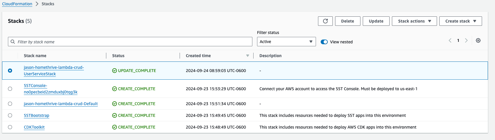

# Homethrive Serverless User CRUD Project
This project follows the project guidelines emailed by the Homethrive dev team.

You can find verification and notes of the project requirements below in the Objective 

## Project Guidelines
### Objective
Develop a CRUD (Create, Read, Update, Delete) microservice named "User" deployable on AWS Lambda, accessible via AWS API Gateway, utilizing the Serverless framework for setup and deployment.

### ✅ Functional Requirements
#### ✅CRUD Operations:

✅ Create: Enable the addition of a new user with fields like UserID, Name, Email, DOB, and other pertinent fields.

✅ Read: Fetch user information based on UserID.

✅ Update: Modify existing user details using UserID.

✅ Delete: Remove a user record based on UserID.


##### ✅ Data Store: Leverage AWS DynamoDB as the data repository.

✅ Craft a performant table design and employ secondary indexes if necessary for optimizing queries.

Since all queries are based on userId, no additional indexes were needed.

##### ✅ API Endpoints: Construct RESTful API endpoints using AWS API Gateway:


✅ /users (POST) - To add a new user.

✅ /users/{UserID} (GET) - To retrieve details of a user.

✅ /users/{UserID} (PUT) - To update details of a user.

✅ /users/{UserID} (DELETE) - To delete a user.


##### ✅ Error Handling: Implement thorough error handling. The service must return descriptive error messages and suitable HTTP status codes for various types of errors.
There are custom Errors with descriptive messages and associated http status codes.

e.g. InvalidRequestError has zod schema validation results that are returned with a 400 status.


#### ✅ Technical Requirements:

✅ Framework: Utilize a serverless framework tool that handles the infrastructure provisioning and deployment automation (SST).  The goal is for ease of development, local testing, and deploying the microservice to AWS Lambda and AWS API Gateway.

I utilized sst v2.  sst v3 was only recently released, so I decided to avoid new release pain points.

✅ Development Language: The microservice must be developed in either Node.js. Ensure compatibility with the chosen language's runtime on AWS Lambda and integration with the Serverless framework.


✅ Deployment: The microservice must be deployable using the serverless deploy command or an equivalent command specific to your setup.


✅ Testing: Incorporate unit tests for the service. Consider using libraries like Jest or Mocha. Think about using mock frameworks to simulate DynamoDB during tests.

I went with sst's vitest recommendation, which is nearly identical to jest, but has some added functionality and wireup that is useful for sst development.
Additional tests for apis and stack configuration would also be useful, but due to time constraints and not being explicitly asked for, I opted to skip.

#### ✅ Business Requirements:
✅ A user can have up to 3 email addresses, but not more

I ensured this logic was applied during both create and update.

✅ A user cannot remove an email address, only add new ones

## Install
This was developed using Node version v22.5.1.  Use NVM to switch to that version for this project.

Run `npm install` in the source directory, which will install for core, functions, etc

## AWS Configuration

### IAM User
Create an IAM User by going to the IAM service.
Click on "Users" and then "Add user."
Provide a username and select "Programmatic access" as the access type.
Set permissions either by attaching existing policies or creating a custom policy.

#### Access Key & Access Secret Key
View the newly created user and click "Create Access Key".  Copy both the access key and access secret key.

#### Permissions
Create a new user group and add the AdministratorAccess permission.

Add the user to the new group.

#### AWS SDK configuration
Create a shared credentials file at `~/.aws/credentials` 
``` 
[default]
aws_access_key_id = YOUR_ACCESS_KEY_ID
aws_secret_access_key = YOUR_SECRET_ACCESS_KEY
```

Set environment variables on your system (bash profile)
```
export AWS_ACCESS_KEY_ID=YOUR_ACCESS_KEY_ID
export AWS_SECRET_ACCESS_KEY=YOUR_SECRET_ACCESS_KEY
```

#### Verify things work
You should now be able to run `npm run dev` and sst will deploy to aws.

You should see output similar to:
``` 
SST v2.43.7  ready!

➜  App:     homethrive-lambda-crud
   Stage:   jason
   Console: https://console.sst.dev/local/homethrive-lambda-crud/jason

✔ Deploying bootstrap stack, this only needs to happen once
|  Default PUBLISH_ASSETS_COMPLETE 
|  Default site/Parameter_url AWS::SSM::Parameter CREATE_COMPLETE 
|  Default site/ServerFunctionRole AWS::IAM::Role CREATE_COMPLETE 
|  Default CustomResourceHandler/ServiceRole AWS::IAM::Role CREATE_COMPLETE 
|  Default LogRetentionaae0aa3c5b4d4f87b02d85b201efdd8a/ServiceRole AWS::IAM::Role CREATE_COMPLETE 
|  Default CustomResourceHandler AWS::Lambda::Function CREATE_COMPLETE 
|  Default site/ServerFunction/AssetReplacerPolicy AWS::IAM::Policy CREATE_COMPLETE 
|  Default LogRetentionaae0aa3c5b4d4f87b02d85b201efdd8a/ServiceRole/DefaultPolicy AWS::IAM::Policy CREATE_COMPLETE 
|  Default site/ServerFunction/AssetReplacer Custom::AssetReplacer CREATE_COMPLETE 
|  Default LogRetentionaae0aa3c5b4d4f87b02d85b201efdd8a AWS::Lambda::Function CREATE_COMPLETE 
|  Default site/ServerFunction/ServerFunction AWS::Lambda::Function CREATE_COMPLETE 
|  Default site/ServerFunction/ServerFunction/LogRetention Custom::LogRetention CREATE_COMPLETE 
|  Default AWS::CloudFormation::Stack CREATE_COMPLETE 

✔  Deployed:
   Default

➜  Start Next.js: cd packages/web && npm run dev

```

### Stacks Console
So that you can view logs from various environments, including local, go to https://console.sst.dev/ and create an account, and link it to your aws account.

Go through the sst console stack creation process in AWS CloudFormation.

## Running Locally
After Install, run `npm run dev`

You will see the sst Console url, as well as the api endpoint url.

e.g.
```shell
➜  App:     homethrive-lambda-crud
   Stage:   jason
   Console: https://console.sst.dev/local/homethrive-lambda-crud/jason

|  UserServiceStack PUBLISH_ASSETS_COMPLETE 
⠋  Deploying...

✔  Deployed:
   UserServiceStack
   ApiEndpoint: https://h676mkqar7.execute-api.us-east-1.amazonaws.com

```

## Testing
### Manual Testing
Ideally we would have an OpenAPI spec which we could import into postman, or generate various clients with.

You can use curl commands to test the service.
#### Create User
400 responses are given for missing or malformed data. See the createUserSchema for the zod schema used to validate.

##### Valid request
```shell
curl -i -X POST https://h676mkqar7.execute-api.us-east-1.amazonaws.com/users \
-H "Content-Type: application/json" \
-d '{
  "firstName": "John",
  "lastName": "Doe",
  "dob": "1990-01-01",
  "emails": ["john@example.com", "johndoe@work.com"]
}'
```

Results in:
```
{
  "userId": "a91d68ff-1382-4294-a3fe-47d48a1e5bf6",
  "dob": "1990-01-01",
  "firstName": "John",
  "lastName": "Doe",
  "emails": [
    "john@example.com",
    "johndoe@work.com"
  ]
}
```

##### Invalid request
```shell
curl -i -X POST https://h676mkqar7.execute-api.us-east-1.amazonaws.com/users \
-H "Content-Type: application/json" \
-d '{
  "firstName": "John",
  "lastName": "Doe",
  "dob": "NineteenNinety-01-01",
  "emails": []
}'
```

Results in:
``` 
HTTP/2 400 
...

{
  "error": "Invalid user data",
  "details": [
    {
      "validation": "regex",
      "code": "invalid_string",
      "message": "Invalid",
      "path": [
        "dob"
      ]
    },
    {
      "code": "too_small",
      "minimum": 1,
      "type": "array",
      "inclusive": true,
      "exact": false,
      "message": "Array must contain at least 1 element(s)",
      "path": [
        "emails"
      ]
    }
  ],
  "name": "InvalidRequestError"
}  
```

#### Get User
Pass the user id returned from create user as part of the path.

400 responses are given for invalid formatted user id (ie other than uuid)

404 responses are given for not found.

##### Valid Request
```shell
curl -i -X GET "https://h676mkqar7.execute-api.us-east-1.amazonaws.com/users/cca00d81-194c-43d6-ab67-b215bf8b2c65"
```

Results in:
``` 
HTTP/2 200 
...
{
  "userId": "cca00d81-194c-43d6-ab67-b215bf8b2c65",
  "dob": "1990-01-01",
  "firstName": "John",
  "lastName": "Doe",
  "emails": [
    "john@example.com",
    "johndoe@work.com"
  ]
}
```

##### Invalid Request

```shell
curl -i -X GET "https://h676mkqar7.execute-api.us-east-1.amazonaws.com/users/cca00d81-194c-43d6-ab67-b215bf8b2c61"
```
Results in:
```shell
HTTP/2 404 
...
{"error":"User with id cca00d81-194c-43d6-ab67-b215bf8b2c61 not found","name":"UserNotFoundError"}
```

#### Update User
Update the user data in the database to reflect what is passed in.

User emails are additive _only_.  No removals are allowed. i.e. you must pass in existing emails as well as new ones.

```shell
curl -i -X PUT https://h676mkqar7.execute-api.us-east-1.amazonaws.com/users/cca00d81-194c-43d6-ab67-b215bf8b2c65 \
-H "Content-Type: application/json" \
-d '{
  "firstName": "John",
  "lastName": "Updated",
  "dob": "1990-01-01",
  "emails": [
    "john@example.com",
    "johndoe@work.com",
    "added@email.com"
  ]
}'
```

Results in:
``` 
{
  "userId": "cca00d81-194c-43d6-ab67-b215bf8b2c65",
  "dob": "1990-01-01",
  "firstName": "John",
  "lastName": "Updated",
  "emails": [
    "added@email.com",
    "john@example.com",
    "johndoe@work.com"
  ]
}
```

#### Delete User
Delete a user and associated emails from the db.


```shell
curl -X DELETE "https://h676mkqar7.execute-api.us-east-1.amazonaws.com/users/cca00d81-194c-43d6-ab67-b215bf8b2c65"
```

## Automated Tests
The project follows sst's guidelines for tests https://docs.sst.dev/testing

Currently only unit tests for the core package are implemented, but in the future it would be wise to implement api integration tests, stack tests, etc.

To run automated tests, run the `npm test` command.

## Deploy
To deploy to production, run the `npm run deploy` command.

## Project Structure
### stacks
These modules serve as a way to define your infrastructure in AWS CloudFormation, using CDK (cloud development kit)

A stack groups together AWS resources, such as Lambda functions, API Gateway Endpoints, and Dynamo DB tables.

### packages
Packages are used to house business logic, shared modules, and versioning. 

#### package/core
These modules serve as core domain business logic and functionality, and follow a Service Oriented Architecture, with Single Responsibility Principle, Separation of Concerns, and Inversion of Control.

##### Services
Services hold business logic, and orchestrate performing input validations, repository interactions, data mapping, etc.

##### Models
Models are interfaces and classes which structure the data in and out of the various layers of the app.
They do not contain business logic, typically.

##### Repository
Repositories abstract and simplify interactions with the underlying database.  These also prove useful when performing unit tests, as you only need to mock the repository, rather than deal with the quirks of mocking a 3rd party library/sdk.

##### Factories
Factories are convenience functions/classes that house mapping logic between models, simplify instantiation, etc.

##### Schemas
Schemas are used for input and output validation.  

e.g. ensuring that firstName is present and doesn't contain special characters, numbers, etc.

#### packages/functions
These modules serve as lightweight endpoints which wrap core functionality.  

These should only be concerned with abstracting http, lambda, etc functionality from core, and should not contain business logic.

There are functions for createUser, deleteUser, getUser, and updateUser.

